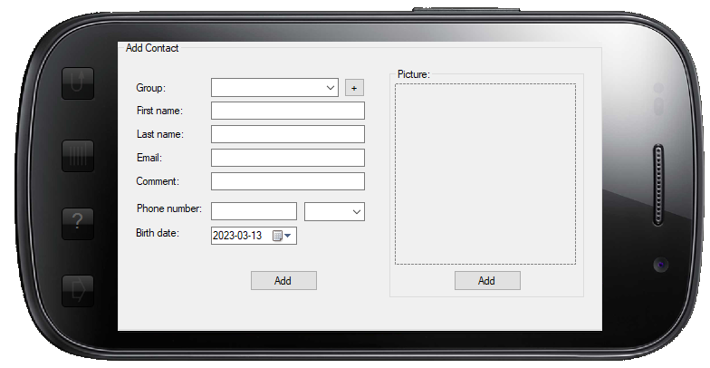
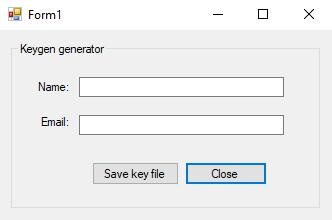
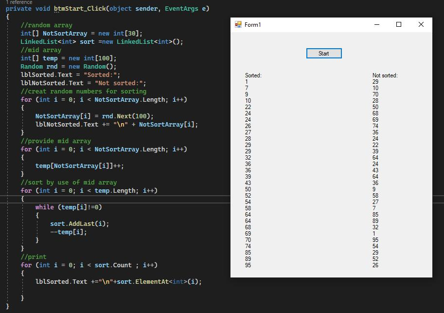
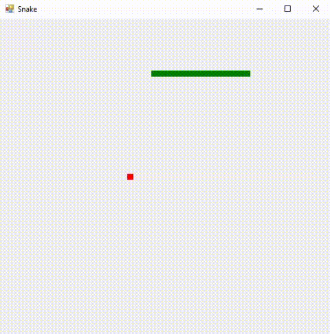

# Old Projects from 2013-2014
### [Calculator](./calculator)
A project about operators order of calculations

### [Pie Chart](<./Circle Chart>)
Drawing simple pie chart

### [Loading](<./Loading>)
Drawing simple pie chart

### [Phone Book](<./Phonebook>)

### [Phone Book Key Generator](<./PhoneBookKeygen>)

### [Implementations of Self-Indexed Sort](<./SIS>)

An implementation of Self-Indexed Sort algorithm which has **O(n)**

### [Old Snake Game :)](<./Snake>)

### [Draw Information On Taskbar](<./TaskbarInformation>)
It draws CPU and RAM usage on screen
